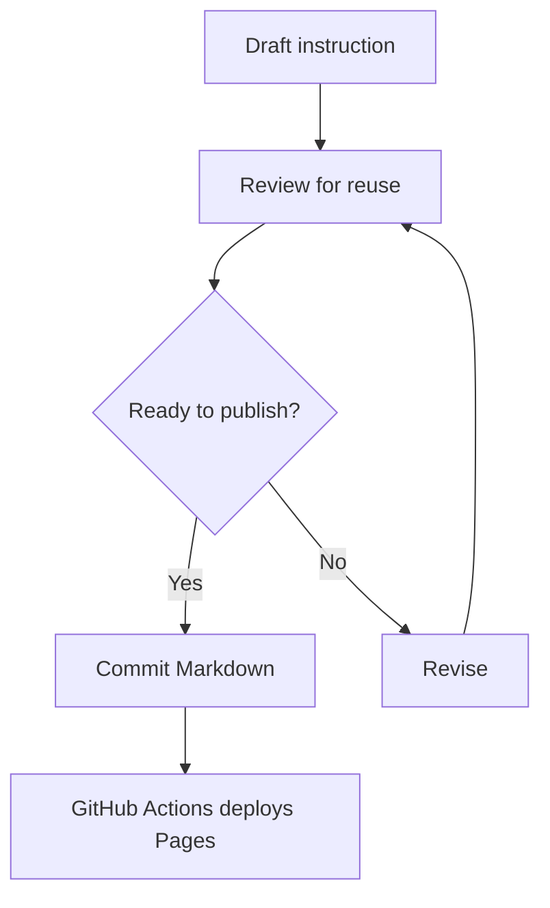

---
tags:
  - overview
  - getting-started
---

# KB Lab Knowledge Base

Welcome to your reusable Markdown knowledge base. This site is designed for instruction templates, agent playbooks, coding standards, prompt patterns, repeatable workflows, and school information maintained as Markdown files.

## Recommended structure

Store all public content under `docs/` and group reusable instructions or reference information by topic:

```text
docs/
├── index.md
├── tags.md
├── instructions/
│   ├── index.md
│   └── reusable-instruction-template.md
├── Latymer/
│   └── index.md
└── assets/
    └── images/
```

## Why this setup

This knowledge base uses **MkDocs Material** because it provides a professional documentation theme, strong navigation, built-in search, tags, Mermaid diagrams, admonitions, collapsible sections, and rich Markdown extensions without requiring a browser-based editor.

The most useful companion plugin for a tree-style document library is **mkdocs-awesome-pages-plugin**. It lets you control section order with small `.pages` files while still allowing your Markdown collection to grow naturally as folders are added.

## Authoring features

!!! tip "Reusable writing pattern"
    Keep each page focused on one reusable behavior, standard, workflow, or school information topic. Use tags to make cross-topic discovery easier.

??? example "Expandable sections"
    Use collapsible blocks for optional details, examples, anti-patterns, or implementation notes.



## Next steps

1. Add more instruction pages under `docs/instructions/` and school information under `docs/Latymer/`.
2. Keep section indexes and `.pages` navigation files up to date as content grows.
3. Validate changes with `mkdocs build --strict` before publishing.
