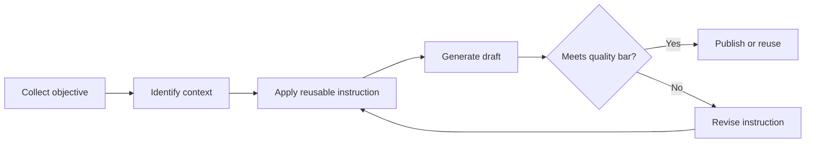

---
tags:
  - template
  - ai-instructions
  - workflow
---

# Reusable Instruction Template

Use this page as a starter format for reusable AI instructions, agent procedures, coding standards, or workflow playbooks.

## Purpose

Describe the reusable behavior this instruction should produce. Keep the purpose short, concrete, and outcome-oriented.

!!! example "Purpose statement"
    Use this instruction when an AI assistant needs to convert ambiguous user requirements into a clear implementation plan before writing code.

## When to use

- The task is repeated often enough to deserve a standard process.
- The expected output format should stay consistent across AI sessions.
- The instruction contains domain knowledge, review criteria, or decision rules that should not be rewritten every time.

## Inputs

| Input | Required | Description |
| --- | --- | --- |
| Objective | Yes | The goal the AI assistant should accomplish. |
| Context | Yes | Repository, product, audience, or business context. |
| Constraints | Optional | Style, tooling, compliance, performance, or delivery constraints. |
| Examples | Optional | Good or bad examples that clarify the desired behavior. |

## Instruction body

Copy and adapt the following instruction block when creating a new reusable page:

```markdown
You are helping with: {{objective}}.

Use the provided context to produce a practical, structured result.

Requirements:
- Confirm assumptions before acting when requirements are ambiguous.
- Prefer reusable patterns over one-off solutions.
- Explain trade-offs when there are multiple reasonable choices.
- Produce outputs in Markdown with clear headings, bullets, and action items.

Before finalizing:
- Check that the answer addresses the original objective.
- Remove irrelevant implementation detail.
- Include next steps when follow-up action is expected.
```

## Workflow



## Quality checklist

- [ ] The instruction has a clear purpose.
- [ ] Required inputs are listed.
- [ ] The output format is explicit.
- [ ] Edge cases or ambiguity rules are documented.
- [ ] Examples are included when they improve reuse.

??? note "Optional implementation notes"
    Use expandable sections for details that are useful but not required for every reader, such as rationale, edge cases, or alternate versions.

## Example output format

```markdown
# Result Title

## Summary
- Key result one.
- Key result two.

## Recommended approach
1. First action.
2. Second action.
3. Validation step.

## Follow-up questions
- Question one, if needed.
```

## Maintenance guidance

Review reusable instructions periodically. Update them when tooling changes, repeated failure patterns appear, or the instruction becomes too broad to remain useful.
