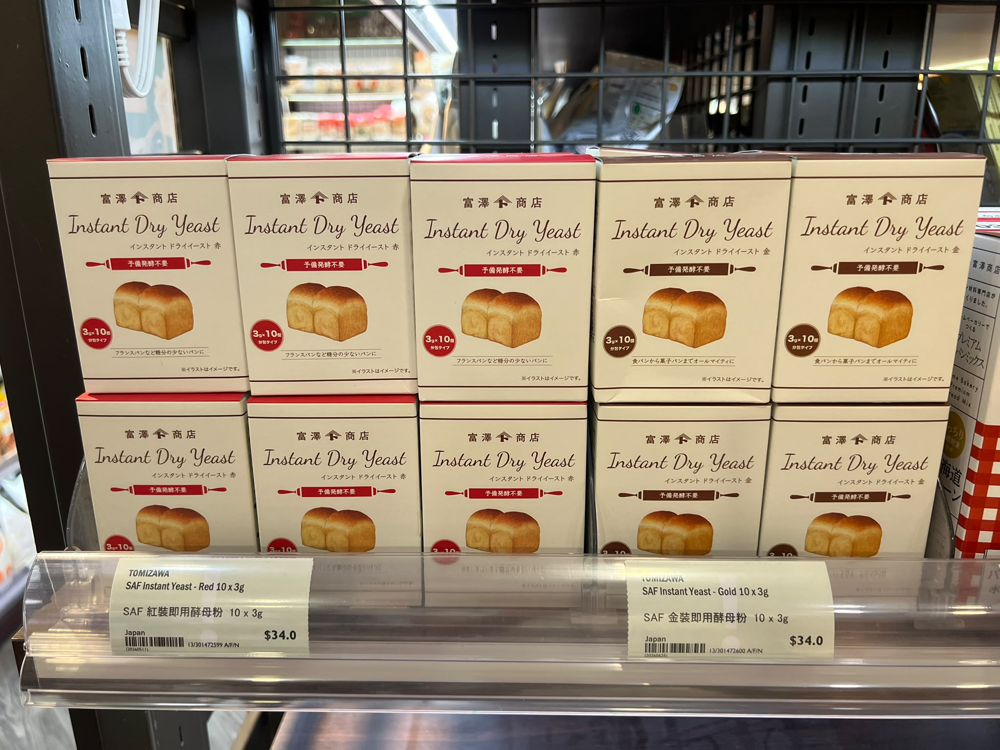

# SAF 即發乾酵母選購指南

相中係富澤商店（TOMIZ）分裝嘅 **SAF Instant Dry Yeast**。兩款都係即發乾酵母，唔使預先開酵，可以直接混入麵粉；揀邊款主要視乎麵團嘅糖分。

!!! tip "快速決定"
    - **整普通、低糖麵包：揀紅色（Red）**
    - **整甜麵包：揀金色（Gold）**
    - **只買一盒、想用途最廣：揀金色（Gold）**

## 紅色同金色有咩分別？

|  | 🔴 紅色 SAF | 🟤 金色 SAF |
| --- | --- | --- |
| 適合糖分 | 麵團糖分少於約 5% | 麵團糖分約 5% 或以上 |
| 特點 | 喺低糖麵團發酵較快 | 專為高糖環境設計 |
| 適合麵包 | 法包、普通白吐司、Pizza、Focaccia、鄉村包 | 奶油包、牛奶包、甜吐司、菠蘿包、Brioche |

## 點解要分開？

糖會吸走水分，令酵母較難工作：

- **紅色酵母**喺高糖麵團入面會變得冇咁活躍，發酵會慢，甚至可能發唔起。
- **金色酵母**經過特別培養，可以喺高糖環境下仍然保持良好發酵能力。

## 按麵包種類揀選

=== "買金色（Gold）"

    適合甜麵包或材料較豐富嘅麵團，例如：

    - 北海道牛奶吐司
    - 生吐司
    - 牛奶餐包
    - 菠蘿包
    - 忌廉包
    - Brioche

=== "買紅色（Red）"

    適合糖分較低嘅麵團，例如：

    - 法包（Baguette）
    - 鄉村包
    - Pizza
    - Focaccia
    - 普通白吐司（糖分好少）

## 整椰賓應該買邊款？

椰賓（椰子賓）麵包通常會用到糖、牛奶、牛油同雞蛋，糖分一般會超過 8–10%。

!!! success "建議：買金色（Gold）"
    金色酵母喺高糖麵團嘅發酵表現會穩定啲，成品體積通常會更大、更鬆軟。

## 如果只可以買一盒

首選 **金色（Gold）**：

- 可以應付甜麵包。
- 用嚟整一般吐司亦冇問題；喺低糖麵團有時會比紅色稍慢，但差距唔大。
- 對家庭烘焙嚟講用途最廣。

如果之後主要跟日本 YouTube 或富澤商店嘅食譜，整牛奶吐司、生吐司或者日式餐包，都建議長期使用 **SAF Gold（金色）**。
